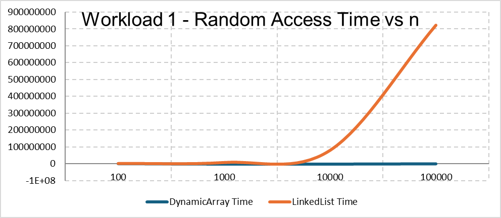
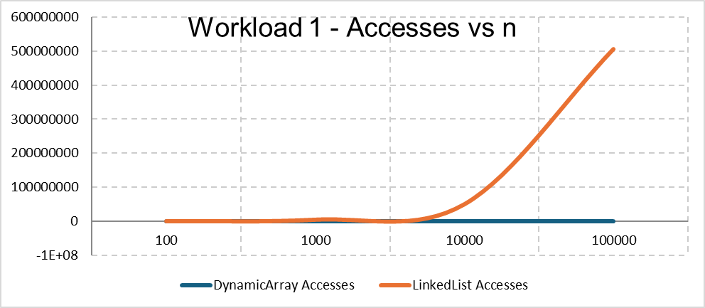
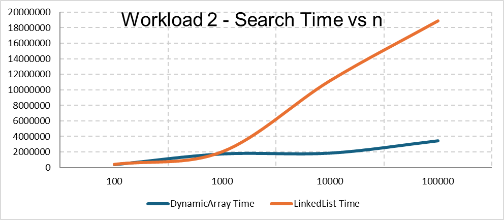
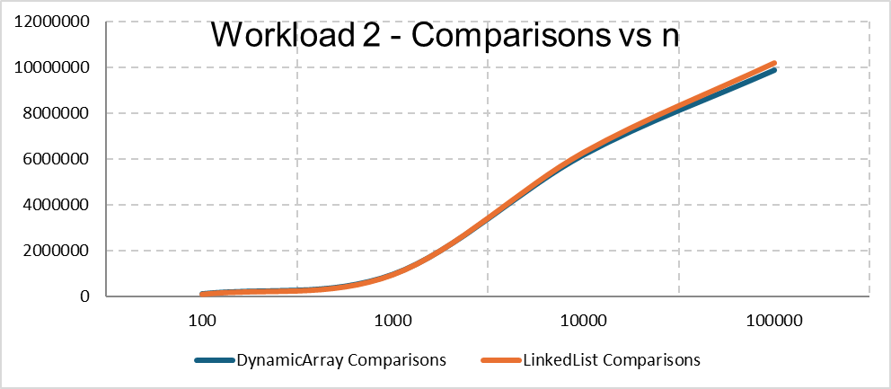
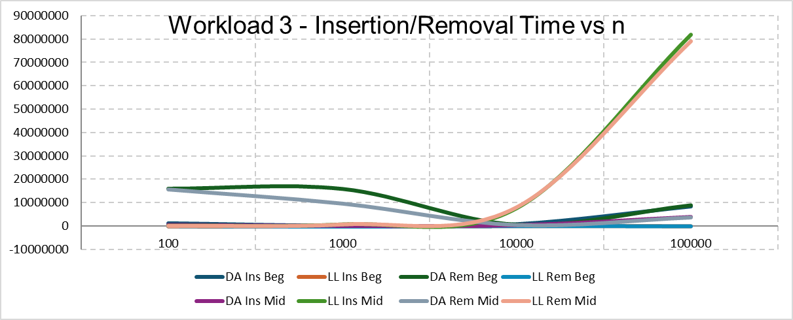
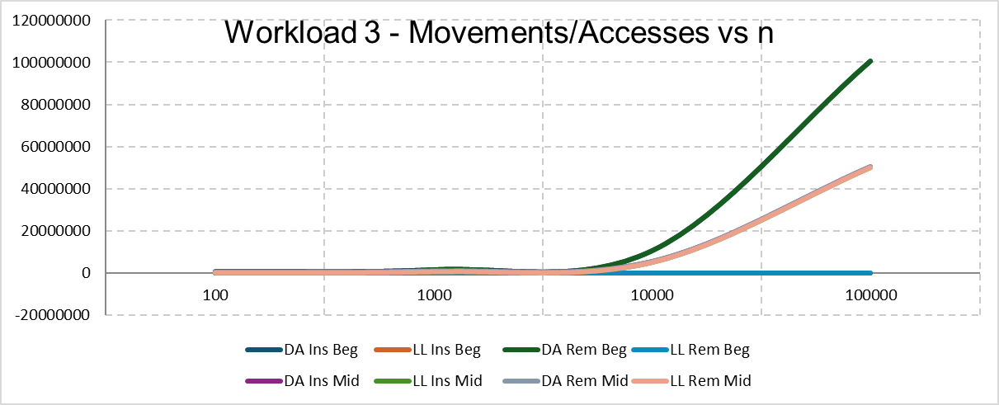
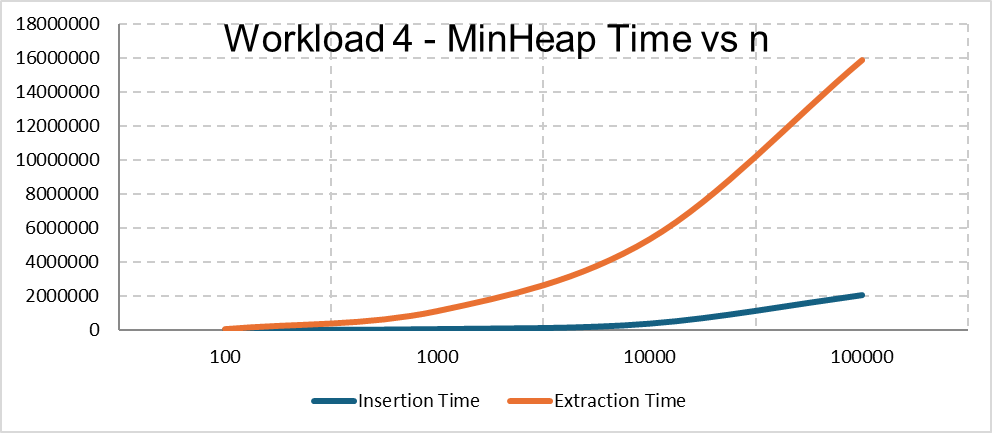
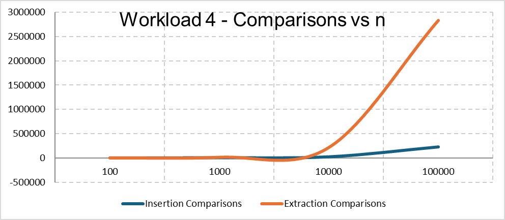

# Assignment 2 
## 1. Overview
In this assignment, I implemented three data structures in Java:

- Dynamic Array
- Linked List
- Min Heap

## 2. Complexity Analysis

### Dynamic Array

**add(x)**
- Best: O(1)
- Average: O(1) amortized
- Worst: O(n)

**add(index, x)**
- Best: O(1)
- Average: O(n)
- Worst: O(n)

**remove(index)**
- Best: O(1)
- Average: O(n)
- Worst: O(n)

**get(index)**
- Best: O(1)
- Average: O(1)
- Worst: O(1)

**contains(x)**
- Best: O(1)
- Average: O(n)
- Worst: O(n)

Dynamic Array gives fast access by index because elements are stored in an array.

### Linked List

**add(x)**
- Best: O(1)
- Average: O(n)
- Worst: O(n)

**add(index, x)**
- Best: O(1)
- Average: O(n)
- Worst: O(n)

**remove(index)**
- Best: O(1)
- Average: O(n)
- Worst: O(n)

**get(index)**
- Best: O(1)
- Average: O(n)
- Worst: O(n)

**contains(x)**
- Best: O(1)
- Average: O(n)
- Worst: O(n)

Linked List is fast for insertion and removal at the beginning.

### Min Heap

**insert(x)**
- Best: O(1)
- Average: O(log n)
- Worst: O(log n)

**peekMin()**
- Best: O(1)
- Average: O(1)
- Worst: O(1)

**extractMin()**
- Best: O(1)
- Average: O(log n)
- Worst: O(log n)

Min Heap keeps the minimum value at the root.

## 3. Correctness

### Proof 1 - Dynamic Array Insert

**Loop invariant:**  
Elements after `i` are already shifted right.

**Initialization:**  
At the start, nothing is shifted.

**Maintenance:**  
Each loop moves one element right.

**Termination:**  
All needed elements are shifted, so the new value can be inserted.


### Proof 2 - Min Heap Insert

**Loop invariant:**  
The heap is correct except possibly between the new element and its parent.

**Initialization:**  
The new element is added at the end.

**Maintenance:**  
If it is smaller than its parent, they are swapped.

**Termination:**  
The loop stops when the element is in the correct position.

## 4. Experimental Setup

Values of `n`:

- 100
- 1,000
- 10,000
- 100,000

Each experiment was repeated 5 times.

Timing method:

```java
System.nanoTime();
```

Random seed:

```java
new Random();
```

Workloads:

- Workload 1: 10,000 random accesses
- Workload 2: 1,000 searches
- Workload 3: 1,000 insertions and removals
- Workload 4: Min Heap insert and extract

## 5. Results

Results are stored in:

- results/tables/
- results/plots/


















## 6. Discussion

Dynamic Array was faster for random access.

Linked List was faster for insertion and removal at the beginning.

Min Heap returned values in non-decreasing order.

The results generally matched the expected complexity.

## 7. Design Recommendations

Use Dynamic Array for fast random access.

Use Linked List for insertion and removal at the beginning.

Use Min Heap when the minimum value must be found quickly.

## 8. Conclusion

Each data structure is useful for different tasks.
